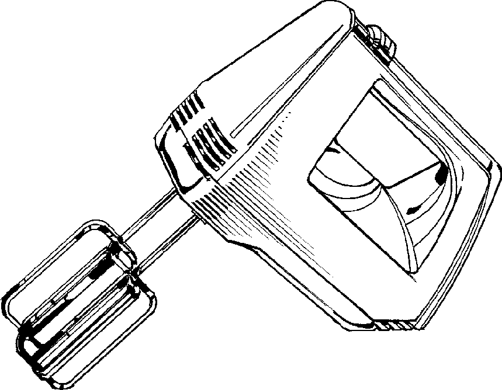

# Elvisp (Work in Progress)
Elvisp distributes a public IPv6 address in a cjdns-based IP tunnel using the public key that each user provides. It will add the user's assigned address with cjdns' admin API. Elvisp then returns the public key for the cjdns instance that acts like the tunnel.

### Tasks implemented
 - [x] `add`
 - [x] `remove`
 - [x] `lease`

### TODO
 - [ ] Tests

### Supported cjdns versions
__Elvisp requires the follwing cjdns admin methods:__
 * `IpTunnel_allowConnection`
 * `IpTunnel_listConnections`
 * `IpTunnel_showConnection`
 * `IpTunnel_removeConnection`
 * `NodeStore_nodeForAddr`

__Note:__
*`IpTunnel_removeConnection` was first implemented with commit `acbb6a8` into the `crashey` branch. As of 2016-06-16 it has not been merged into the `master` branch.*

__Elvisp works with *(kinda)*:__
```
Cjdns version: cjdns-v17.3-129-g116fa2a
Cjdns protocol version: 17
```

### Protocol
See [protocol-v1](doc/protocol-v1.md).
